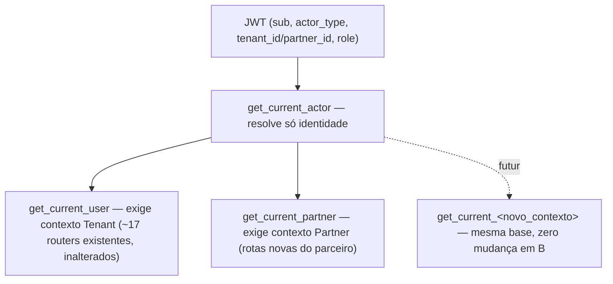

# Programa de Parceiros — Fundação de Autenticação

Data: 2026-07-16
PR: [#459](https://github.com/mickbap/tribultz/pull/459) — aberto, aguardando review
Governança: [ADR-0011](https://github.com/mickbap/tribultz-brain/blob/main/knowledge/decisions/2026-07-16-autenticacao-por-ator-identidade-vs-contexto.md) (decisão canônica) · [RFC-0026](https://github.com/mickbap/tribultz-brain/blob/main/knowledge/rfcs/RFC-0026-programa-de-parceiros.md) (motivo histórico) — ambos em `tribultz-brain`

Este documento registra a **implementação** (o "como"). A decisão em si — e sua abrangência permanente, além do Programa de Parceiros — é canônica no ADR-0011; este PR não a substitui.

## Resumo executivo

Primeira entrega de código do Programa de Parceiros: a plataforma agora sabe autenticar um **parceiro** (ex.: Dra. Kátia Pollon) como ator próprio, sem confundi-lo com uma empresa-cliente (Tenant) e sem exigir uma tela nova de login separada. É a base sobre a qual o cadastro do parceiro, o dashboard dele e a extensão do Command Center serão construídos nas próximas etapas — nenhum desses três ainda existe.

**Nenhuma informação financeira, comissão ou pagamento foi implementada.** Fora de escopo por decisão explícita, conforme RFC-0026.

> **Leitura oficial deste PR:** não é só a documentação de uma feature do Programa de Parceiros — é uma evolução da arquitetura de autenticação da Tribultz, com validade permanente para qualquer ator futuro.

## Decisão arquitetural consolidada

> A autenticação da Tribultz autentica identidades. A autorização define
> contexto e permissões. Novos módulos reutilizam a mesma infraestrutura de
> autenticação. A criação de novos domínios nunca deverá exigir novos
> mecanismos de autenticação.

Decisão canônica: [ADR-0011](https://github.com/mickbap/tribultz-brain/blob/main/knowledge/decisions/2026-07-16-autenticacao-por-ator-identidade-vs-contexto.md) (`tribultz-brain`). Registro nesta implementação:

- **Arquitetura escolhida:** identidade única (`User`) + contexto (Tenant/Partner/futuro) + papel (permissão dentro do contexto) — três camadas, nunca misturadas.
- **Motivo da escolha:** o mecanismo de sessão (`get_current_user`) já resolvia identidade sem depender de `tenant_id`; o único obstáculo real era um schema de payload que tratava `tenant_id` como identidade obrigatória — corrigido na raiz, não contornado.
- **Eliminação do Tenant artificial:** a primeira proposta previa criar uma "empresa" fictícia no banco só para o parceiro logar — descartada por poluir o significado de `Tenant`.
- **Reutilização da infraestrutura existente:** login, convite, primeiro acesso, OTP, recuperação de senha, sessão e auditoria são exatamente os mesmos para qualquer ator — nenhum mecanismo paralelo.

## Modelo arquitetural definitivo

| Camada | O que representa | Exemplos | Onde vive no código |
|---|---|---|---|
| **Identidade** | quem está autenticado — sempre a mesma coisa, para qualquer ator | `User.id` (`sub` no JWT) | `get_current_actor` |
| **Contexto** | onde essa identidade está operando — nunca define identidade | `Tenant`, `Partner`, futuros contextos institucionais | `User.actor_type` (computado) + `tenant_id`/`partner_id` |
| **Papel (role)** | as permissões dentro do contexto | `admin`, `contador`, `owner`, `partner`, `auditor` | `User.role` |

Novos papéis (ex.: um papel novo dentro do contexto Partner) não exigem nova infraestrutura de autenticação — só uma checagem de autorização a mais, no ponto de uso.

### JWT

O token carrega exatamente: identidade (`sub`), contexto ativo (`actor_type` + `tenant_id`/`partner_id` — contextual, nunca os dois), e permissão (`role`). **Não** é modelado como uma enumeração crescente de tipos de usuário — um ator institucional futuro adiciona um valor de `actor_type` e seu próprio campo contextual, sem redesenhar o payload.

### Camadas de autenticação

`get_current_user` e `get_current_partner` são camadas finas de autorização sobre a mesma camada de identidade — nenhuma duplicação de mecanismo.

## Benefícios obtidos

- Eliminação do Tenant artificial (a primeira proposta previa criar uma "empresa" fictícia só para o parceiro logar — descartada).
- Reutilização integral da infraestrutura de autenticação existente — nenhum sistema paralelo.
- Compatibilidade total com os usuários e tenants atuais — zero regressão (677/677 testes).
- Base preparada para novos atores institucionais futuros, sem necessidade de redesenho.
- Redução de dívida técnica futura: a próxima vez que a plataforma precisar de um novo tipo de ator, o modelo já existe.

## O que NÃO muda (para evitar interpretação futura equivocada)

Permanecem **inalterados**: fluxo de login, convite, primeiro acesso, OTP, recuperação de senha, auditoria, sessão, usuários atuais, tenants atuais. Esta entrega **estende** a autenticação para um novo domínio de ator — não **substitui** nem **modifica** o comportamento existente para quem já usa a plataforma hoje.

**Compatibilidade:** nenhum fluxo existente sofre regressão — todo usuário atual continua operando exatamente como hoje. A introdução do Partner não altera o comportamento dos tenants existentes (confirmado pelos 677/677 testes de regressão, seção Validação).

## O que muda, na prática

Hoje, todo login na Tribultz assume implicitamente "isso é alguém de uma empresa cliente". Essa entrega generaliza esse conceito: o sistema de login passa a reconhecer **dois tipos de ator** — quem é de uma empresa (como sempre foi) e quem é um parceiro (novo). Um parceiro poderá usar exatamente o mesmo fluxo de convite, criação de senha e login que qualquer outro usuário já usa hoje — não é um sistema paralelo, é o mesmo sistema reconhecendo um novo tipo de conta.

Guardrail preservado: um Partner **nunca** vira uma empresa-cliente, e vice-versa. O banco de dados agora **impede estruturalmente** que essa distinção seja violada por acidente (não é só uma regra de código, é uma restrição no próprio banco).

## Validação

- 14 testes novos, cobrindo: o parceiro conseguindo logar sem quebrar nada; um parceiro não conseguindo acessar áreas de empresa-cliente (e vice-versa); a restrição do banco funcionando.
- Suite completa do backend: **677 de 677 testes passando** — ou seja, nada que já existia foi afetado.
- Um problema real foi encontrado e corrigido **durante** a implementação (não estava previsto na proposta técnica original): três endpoints antigos chamavam uma função interna de um jeito que quebraria com essa mudança. A ferramenta de checagem de tipos (pyright) pegou isso antes de virar bug em produção; foi corrigido no mesmo PR.

## Escopo delimitado — este PR NÃO implementa

- Cadastro operacional do parceiro (convite, criação de conta de verdade).
- Dashboard do parceiro.
- Comissão.
- Carteira financeira.
- Pagamentos.
- Ranking.
- Gamificação.
- Relatórios comerciais.
- Command Center expandido (visão de parceiros/indicações).

Todos pertencem às próximas etapas do Programa de Parceiros — nenhum está bloqueado por esta entrega, mas nenhum está pronto ainda.

## Estratégia de implementação seguida

1. Modelo definitivo da identidade (`User` como âncora única) — decidido na proposta técnica v1.
2. Modelo definitivo do contexto (`actor_type` + campo contextual) — refinado na proposta técnica v2, após correção do Tenant artificial.
3. Modelo definitivo das permissões (`role`, reaproveitado — já existia) — confirmado durante a mesma revisão.
4. Diagrama simplificado da autenticação — seção "Camadas de autenticação" acima.
5. TDD — 14 testes escritos antes da implementação (`test_partner_auth.py`), incluindo o caso que expôs o bug real (login do parceiro colidindo com resolução de Grant/billing).
6. Implementação — migration, model, schema, `deps.py`, `auth.py`.
7. Validação operacional — suite completa 677/677, ruff limpo, pyright limpo nos arquivos tocados.
8. Revisão arquitetural final — este documento + ADR-0011.

## Decisão de processo que vale registrar

Esta entrega passou por duas rodadas de revisão arquitetural antes de virar código:
1. Primeira proposta previa criar uma "empresa" fictícia no banco só para o parceiro poder logar — foi corretamente barrada por misturar dois conceitos que deveriam ficar separados.
2. Segunda proposta generalizava a solução, mas ainda tratava "tenant" como o conceito central — foi refinada para que o **ator autenticado** (seja ele qual for) vire o conceito central, e "empresa" passe a ser só um contexto usado quando aplicável.

O modelo que entrou em código é o da segunda rodada — pensado para caber o próximo tipo de ator que a Tribultz precisar (ex.: parceiros institucionais maiores) sem precisar redesenhar de novo.

## Próximo passo

PR #459 aguardando review antes do merge. Após aprovado, sigo para o fluxo de criação de conta do parceiro (Etapa seguinte da Fase 1).
